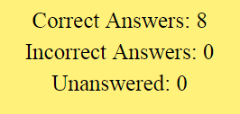

# Totally-90s-Trivia

Created using timers, jQuery, JavaScript, and HTML5, this trivia app is designed to test your knowledge of the most absurd decade of the 20th Century.

Click https://kerrickwoyshner.github.io/Totally-90s-Trivia/ to enter the trivia...

And make sure to answer the questions before time runs out - you have 30 seconds for each of the 10 questions.  Good luck!

See if you can get on my bro's level:

