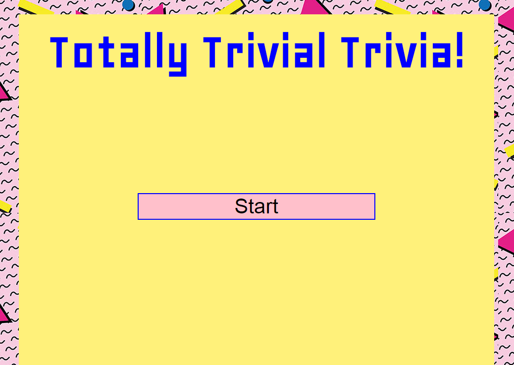
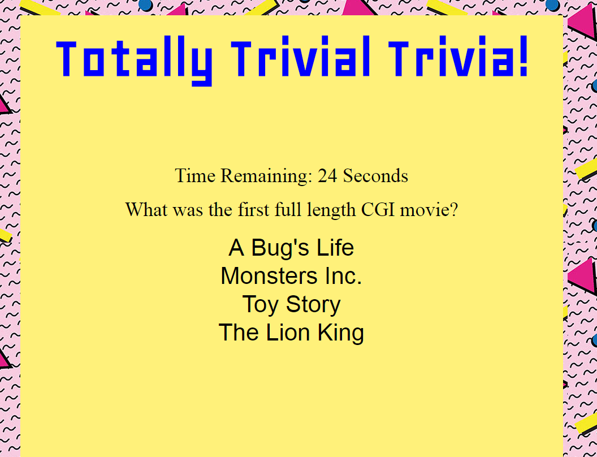

# Totally-90s-Trivia

Created using timers, jQuery, JavaScript, and HTML5, this trivia app is designed to test your knowledge of the most absurd decade of the 20th Century.

Click https://kerrickwoyshner.github.io/Totally-90s-Trivia/ to enter the trivia...

And make sure to answer the questions before time runs out - you have 30 seconds for each question (there are 10 questions total).  Good luck!

If you get any of the questions wrong, don't be discouraged.  You can always click "Start Over" at the end of the trivia to get on my bro's level:

